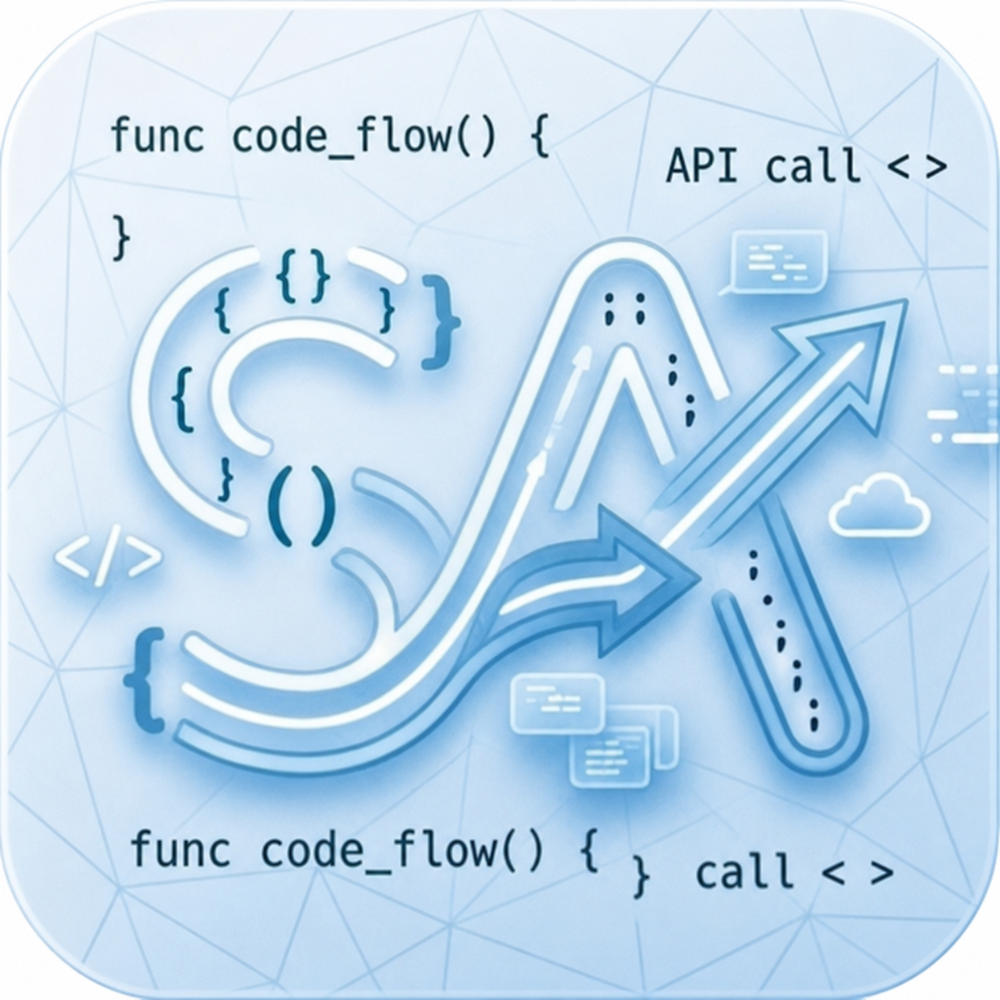
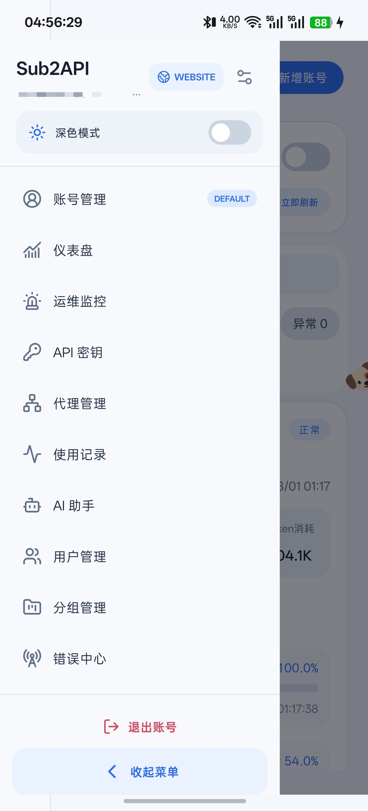
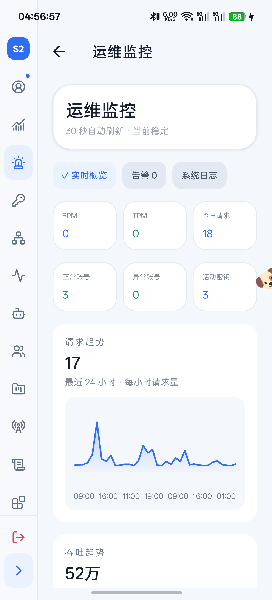
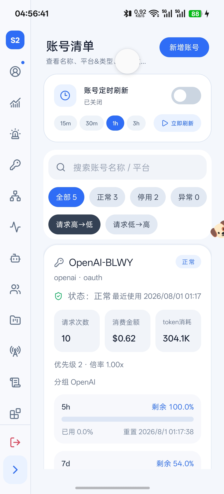
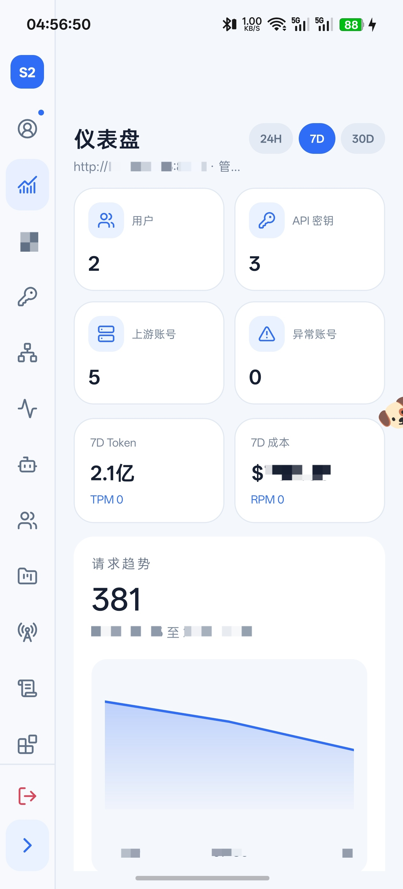
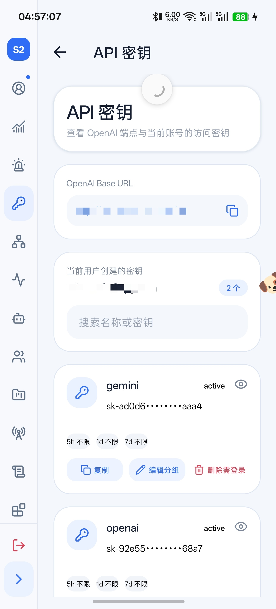
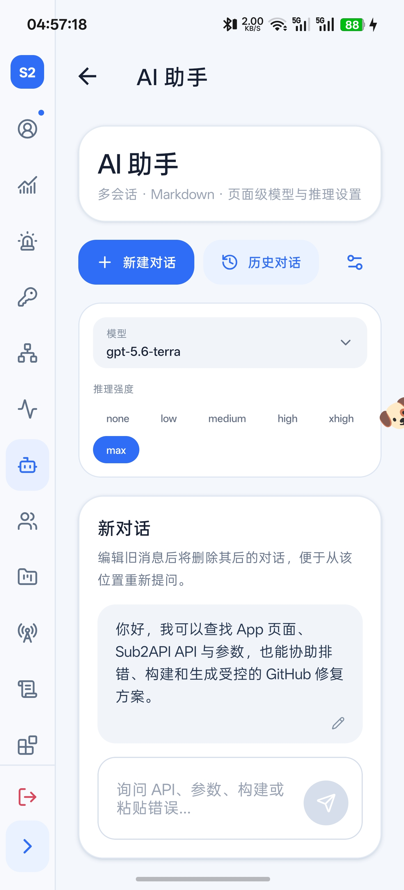

[English](README.md) | [**简体中文**](README.zh-CN.md)

<p align="center">
  
</p>

<h1 align="center">Sub2API Mate</h1>

<p align="center">
  基于 Expo SDK 54 和 React Native 构建的 Sub2API 独立移动管理助手与控制台。
</p>

> [!IMPORTANT]
> **灵感来源与致谢。** 本项目的灵感来自 [ckken/sub2api-mobile](https://github.com/ckken/sub2api-mobile)。衷心感谢 ckken 发布原始开源成果。上游项目使用 MIT License，本仓库在 [LICENSES/MIT-ckken.txt](LICENSES/MIT-ckken.txt) 中完整保留了原作者版权声明和许可证正文。本仓库大幅扩展的移动端界面、管理功能覆盖、AI 助手、构建中心和自动化由 trilogys contributors 独立维护；这不表示原作者对本项目提供背书。

当前维护仓库为 [trilogys/sub2api-mobile](https://github.com/trilogys/sub2api-mobile)。本仓库不会自动合并或同步其他 Sub2API Mobile Fork 的源代码；定时同步功能只读取 Sub2API 服务端的 API 元数据。

## 项目简介

Sub2API Mate 把 Sub2API 部署的日常管理、诊断和构建流程带到 Android、iOS 与 Web。它是由社区独立维护的移动伴侣，并非 Sub2API 官方客户端。项目提供按角色区分的权限、适配手机的蓝白卡片界面、完整的管理接口入口、移动端专用页面、可选 AI 助手，以及可以在手机上触发的云端 APK 构建。

> [!NOTE]
> **测试范围：** 当前版本仅在 Android 平台进行了测试。项目通过 Expo 包含 iOS 和 Web 目标，但这两个平台尚未经过完整验证。

当前生成的 API 覆盖报告包含 **382 条管理路由**：

- **132** 条已有移动端专用服务封装。
- 另外 **250** 条可通过通用 API 控制台访问。
- 已发现但无法访问的路由为 **0**。

## 界面预览

以下 6 张效果图仅展示项目的一部分。

<table>
  <tr>
    <td align="center"><br /><sub>自定义导航与账号操作</sub></td>
    <td align="center"><br /><sub>运维监控与请求趋势</sub></td>
  </tr>
  <tr>
    <td align="center"><br /><sub>账号管理、额度与刷新控制</sub></td>
    <td align="center"><br /><sub>仪表盘指标与时间范围图表</sub></td>
  </tr>
  <tr>
    <td align="center"><br /><sub>当前用户的 API 密钥管理</sub></td>
    <td align="center"><br /><sub>上下文 AI 助手与历史会话</sub></td>
  </tr>
</table>

## 已实现功能

### 登录与权限

- 使用“服务器地址 + 邮箱 + 密码”，通过官方 `/api/v1/auth/login` 流程登录。
- 使用“服务器地址 + Admin Key”，通过 `x-api-key` 访问管理接口。
- 自动处理以 `/api/v1`、`/v1` 或根路径结尾的服务器地址，避免重复拼接路径。
- 可记住多个登录账号，在登录页下拉选择；不再需要的账号信息可以删除。
- Android/iOS 的活动凭据保存在系统 SecureStore；Web 端不持久化敏感信息。
- 邮箱账号令牌过期后自动刷新会话。
- 管理员显示完整管理菜单，普通用户只显示经过限制的个人自助功能。
- 可从左侧菜单或“更多管理”退出账号、切换账号并返回登录页。

Admin Key 本身不包含“当前用户”身份，因此个人密钥增删改查需要使用邮箱账号登录；管理员也可以从用户管理进入指定用户的密钥页面。

### 导航、外观与易用性

- 面向窄屏手机优化的蓝白色响应式卡片设计。
- 左侧菜单支持收起和展开：收起时只显示图标，展开时显示文字。
- 菜单项区域独立滚动，底部账号操作与收起/展开按钮保持固定。
- 长按拖拽菜单项可实时换位，支持隐藏项目并持久化排序。
- 可指定默认启动页；对应菜单显示 `DEFAULT` 标签，下次启动自动进入该页面。
- 关闭左侧栏时自动退出自定义菜单模式。
- 默认浅色模式，支持深色模式并保存设置。
- 默认简体中文，可切换英文界面。
- 顶部 Website 按钮可以在浏览器打开当前连接的服务器。
- 复制、创建、编辑、启用、停用、删除及失败操作均提供明确反馈。

### 仪表盘与运维监控

- 支持 24 小时、7 天和 30 天统计范围。
- 展示用户、API 密钥、上游账号、异常账号、Token、成本、RPM、TPM 和请求数。
- 小屏或侧栏收起后，适用的统计卡片仍保持紧凑的双列布局。
- 请求、吞吐、Token、成本、延迟和账号切换趋势图。
- 运维实时概览包含健康状态、告警、系统日志、请求速率、活动密钥、账号状态和近期趋势。
- 独立错误中心和结构化运维诊断入口。

### 账号管理

- 新增账号的类型和字段尽量与官方 Sub2API 保持一致。
- 支持按名称或平台搜索、状态筛选、请求量从高到低或从低到高排序。
- 正常、停用、不可用账号分别使用绿色、黄色和红色状态图标。
- 账号详情支持分组、优先级、倍率、并发上限、状态、凭据和维护操作。
- 额度统一以百分比展示；服务端提供数据时显示 5 小时与 7 天额度窗口。
- 重置前先查询是否具有可用重置次数。
- 模型测试支持明确选择模型，并改善无效服务端响应的诊断信息。
- 可选账号定时刷新，支持多个间隔和立即刷新；相关控制默认隐藏，启用后再显示。

### API 密钥、代理、IP、用户与分组

- 展示 OpenAI 兼容 Base URL，以及当前用户创建的 API 密钥。
- 个人 API 密钥支持查看、显示、复制、新建、编辑、启用、停用和删除。
- 删除前二次确认，复制及状态变更后显示成功或失败提示。
- 展示服务端返回的密钥状态、分组、限制、有效期和兼容端点信息。
- 支持用户与分组增删改查、用户密钥查看、账号分组和角色权限管理。
- 代理支持增删改查，列表外层可直接进行连通测试和质量检测。
- 支持 IP 白名单和黑名单；IP 管理默认不显示在菜单中，但管理员仍可添加。

### 使用记录

- 紧凑的记录卡片，顶部状态字段可自定义。
- 请求详情尽量展示端点、客户端 IP、分组、用户、密钥、上游账号、模型和响应状态。
- Token 明细包含输入、输出、缓存和总 Token。
- 详情中提供费用、延迟、TTFT、服务层级、计费模式和时间信息。
- 即使外层界面使用中文，卡片中的简短指标标签仍采用英文，减少拥挤。

### 更多管理

“更多管理”集中展示当前服务器和会话信息、语言、外观、账号切换及高级管理入口。这里不再新增任意服务器；需要切换部署时，请退出并在登录页选择已记住的账号。

高级页面包括兑换码、订阅、渠道、风控、合规确认、审计日志、公告、优惠码、提示词审计、备份恢复、系统维护、用户自定义属性、流量策略、定时测试、渠道监控、推广返利、运维中心、OAuth、通用 API 控制台、GitHub 设置和构建中心。

### API 检索与覆盖

项目通过两层机制保持接口信息更新：

1. **App 运行时检索。** 通用 API 控制台可以从 [Wei-Shaw/sub2api](https://github.com/Wei-Shaw/sub2api) 获取最新管理路由元数据，6 小时内复用结果，也可手动强制刷新；失败时回退到 APK 内置元数据。
2. **仓库自动化。** `.github/workflows/sync-sub2api-api.yml` 每天或手动执行，提取上游路由和类型，重新生成 App API 知识库与覆盖报告；发现变化后创建或更新一个可审核的 PR。

运行时检索只更新路由元数据，不能修改已安装 APK 的源代码。本仓库不会同步 `ckken/sub2api-mobile` 或其他移动端 Fork 的源代码。

### AI 助手

AI 服务配置已经合并到 AI 助手页面：

- OpenAI Responses API 兼容的 Base URL 和 API Key。
- 获取模型列表、按会话选择模型、设置推理强度并测试连接。
- 新建多个持久化会话、切换历史和批量删除。
- 支持上下文连续对话和 Markdown 渲染。
- 编辑较早的消息后删除其后的会话内容，可从该位置重新提问。
- 检索 App 页面、路由、服务、类型、参数和生成的 Sub2API API 知识，回答“某个设置在哪里”等问题。
- 捕获接口错误后协助诊断；获得明确授权后生成受控的 GitHub Draft PR 方案。

AI 助手页面可以开启悬浮助手。长按可移动，靠边时可以部分收起；小型关闭按钮会在 3 秒后隐藏。助手外观可以替换，默认宠物为小狗。悬浮入口同样支持新建对话和切换历史。

### 受控的 GitHub 修复流程

GitHub 设置默认仓库为 `trilogys/sub2api-mobile`，也支持修改并保存。Fine-grained Token 应只授权目标仓库和必要权限：

- Contents：读写
- Pull requests：读写
- Actions：仅在 App 内触发原生构建时需要读写

修复流程会检索相关 `app/` 与 `src/` 文件，在向已配置的 AI 服务发送上下文前遮蔽常见密钥格式，展示建议修改，并要求用户再次确认，之后才会创建分支、提交和 Draft PR。自动修复只允许修改已有应用源码，不允许修改工作流、依赖清单、生成文件或密钥文件。

AI 生成的是待审核建议，不代表已经通过测试。合并前仍需检查差异并运行 CI。

## Android APK 构建

构建中心默认选择 **GitHub 原生构建**，EAS Build 作为可切换的另一种方式。

### GitHub 原生构建（默认）

`.github/workflows/android-native-build.yml` 在 GitHub Runner 中执行 Expo Prebuild 和 Gradle，不进入 EAS 队列，也不需要 `EXPO_TOKEN`。

在 GitHub 网页中：

1. 打开 **Actions**。
2. 选择 **Native Android APK**。
3. 点击 **Run workflow**。
4. `release` 用于可独立安装的 APK，`debug` 用于开发排错。
5. 构建完成后从运行页面的 **Artifacts** 下载 APK。

在 App 中保存具有 Actions 权限的 GitHub Token，选择仓库和分支后即可触发工作流。构建中心通过 GitHub Jobs API 展示：

- Setup Node.js
- Install dependencies
- Expo Prebuild
- Setup Gradle
- Build APK with Gradle
- Upload APK
- 每一步的等待、执行、成功或失败状态
- 根据已完成步骤计算的近似百分比
- APK Artifact 是否可下载、大小、过期时间和下载入口

目标仓库可以切换，默认是 `trilogys/sub2api-mobile`。

### EAS Preview APK

`eas.json` 的 `preview` 使用 internal distribution，并配置 `android.buildType: apk`。

```powershell
cd D:\Project\node\sub2api-mobile
npm ci
npx eas-cli@latest login
npx eas-cli@latest build --platform android --profile preview
```

建议第一次在电脑完成构建，以确认 Expo 项目与 Android 签名凭据。完成初始配置后，可以在手机 App 中安全保存 Expo Access Token、启动 EAS Workflow、查询状态并打开下载页面。实际 Android 构建始终在 EAS 云端执行。

若通过 GitHub Actions 启动 EAS，请在 **Settings → Secrets and variables → Actions** 添加 `EXPO_TOKEN`，然后运行 `.github/workflows/eas-build.yml`。GitHub 原生构建不使用该 Secret。

完整发布说明见 [docs/EXPO_RELEASE.md](docs/EXPO_RELEASE.md)。

## 本地开发

要求：

- Node.js 20 或更高版本
- npm 10 或更高版本
- 使用模拟器或原生调试时需要 Android Studio 与 Android SDK

安装并启动 Expo：

```bash
npm ci
npm run start
```

常用目标：

```bash
npm run android
npm run ios
npm run web
```

常用验证命令：

```bash
npx tsc --noEmit
npm run audit:api-coverage
npx expo config --type public
npx expo export --platform android
```

## API 元数据维护

```bash
# 重新生成 App 页面/API 检索知识库
npm run generate:api-knowledge

# 从已检出的 Sub2API 服务端源码提取路由、参数和类型
npm run extract:upstream-api -- /path/to/sub2api

# 验证每条路由都有专用封装或通用控制台入口
npm run audit:api-coverage
```

## 项目结构

```text
app/                    Expo Router 页面
src/components/         通用 UI、导航、图表和 AI 助手
src/screens/            可复用的移动管理页面
src/services/           Sub2API、AI、GitHub 和 EAS 服务
src/generated/          路由、上游元数据、界面文案、知识库和覆盖报告
src/store/              持久化应用设置与会话状态
src/lib/                请求、认证和通用工具
.github/scripts/        API 提取、生成和覆盖审计脚本
.github/workflows/      原生/EAS 构建与 API 元数据同步
.eas/workflows/         可由 App 触发的 EAS Workflow
docs/                   发布文档与效果图
server/                 Web 开发环境的本地 Express 代理
```

## 安全说明

- Android/iOS 敏感信息使用操作系统 SecureStore。
- Web 端不持久化 Admin Key、AI Key、Expo Token 或 GitHub Token。
- Token 不写入生成的路由元数据、日志或本地 AI 知识库。
- 写接口、构建和 GitHub PR 创建均需要用户明确操作。
- AI、Expo 与 GitHub 应分别使用最小权限、可撤销的独立 Token。
- 安全问题请按照 [SECURITY.md](SECURITY.md) 披露。

## 参与贡献

欢迎贡献。提交前请阅读 [CONTRIBUTING.md](CONTRIBUTING.md) 和 [CODE_OF_CONDUCT.md](CODE_OF_CONDUCT.md)。PR 应清楚描述修改内容，标明来自上游的成果，并保留适用的版权声明。

## 许可证与归属

本仓库整体使用 [Apache License 2.0](LICENSE)。源自 [ckken/sub2api-mobile](https://github.com/ckken/sub2api-mobile) 的成果仍遵循单独保留的 [MIT License 与原版权声明](LICENSES/MIT-ckken.txt)。明确的归属说明见 [NOTICE.md](NOTICE.md)；分发相关成果时必须保留适用的许可证与版权声明。
